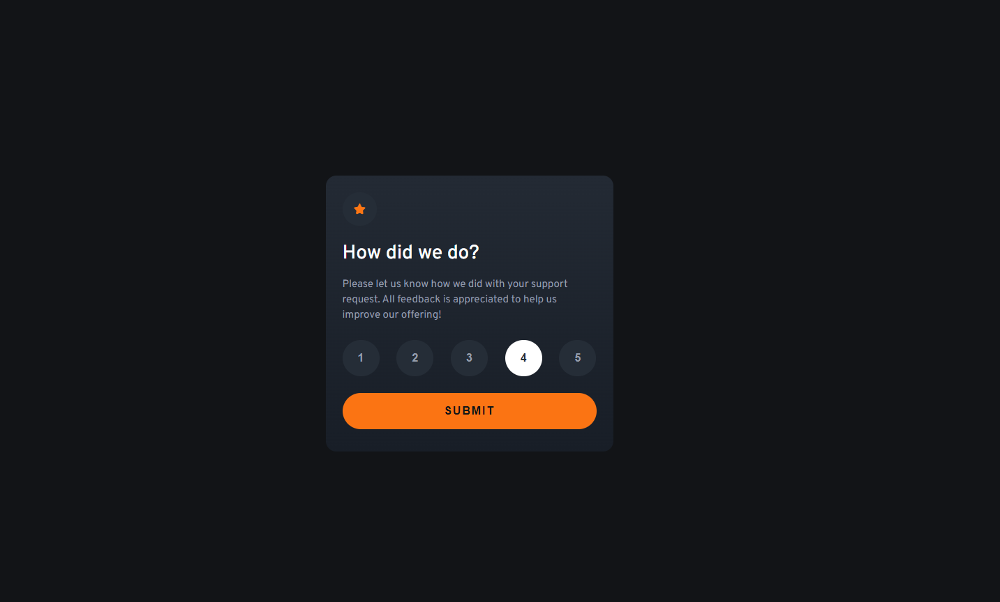
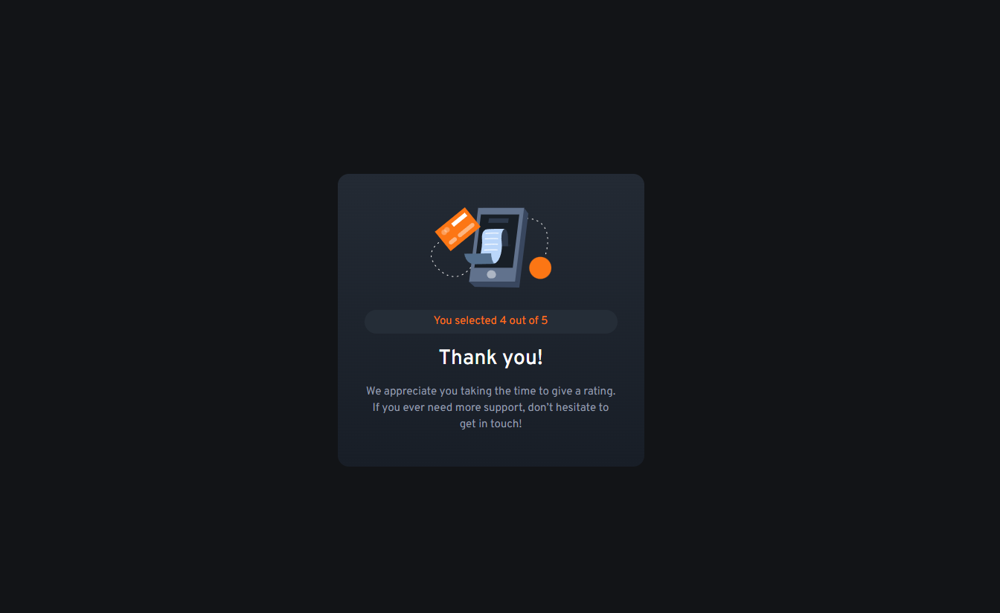

# Frontend Mentor - Interactive Rating Component Solution

This project is my submission for the Interactive Rating Component challenge on Frontend Mentor. Through this challenge, I had the opportunity to sharpen my coding abilities by working on a practical and interactive user interface.

## Table of Contents
- [Overview](#overview)
  - [The Challenge](#the-challenge)
  - [Screenshot](#screenshot)
  - [Links](#links)
- [My Process](#my-process)
  - [Built With](#built-with)
  - [What I Learned](#what-i-learned)
  - [Continued Development](#continued-development)
- [Author](#author)

## Overview

### The Challenge

Users should be able to:

- View the optimal layout depending on their device's screen size.
- See hover states for interactive elements.
- Select and submit a rating from 1 to 5.
- See a thank you message after submitting the selected rating.

### Screenshot




## Links

- [Solution URL](https://github.com/jiehlarae/interactive-rating-component-main.git)
- [Live Site URL](https://jiehlarae.github.io/interactive-rating-component-main/)

## My Process

### Built With

- Semantic HTML5 markup
- CSS custom properties
- Flexbox
- Mobile-first workflow
- JavaScript for dynamic behavior

### What I Learned

This project helped me deepen my understanding of JavaScript for managing user interactions. Here's a snippet of code that I’m particularly proud of:

```javascript
for (let btn of btns) {
    btn.addEventListener('click', function () {
        for (let b of btns) {
            b.style.backgroundColor = '';
            b.style.color = '';
        }

        btn.style.backgroundColor = '#fff';
        btn.style.color = '#262E38';
        ratingValue = btn.innerText;
    })
}

submitBtn.addEventListener('click', function () {
    startState.style.display = 'none';
    ratingState.style.display = 'block';
    rateScore.innerText = ratingValue;
})
```

This code manages the rating selection and displays the thank you message upon submission. Additionally, I enjoyed using Flexbox to ensure a responsive design that works well across different screen sizes.

### Continued Development

Going forward, I plan to explore more about forms and how they function, particularly focusing on form validation and submission handling. I aim to deepen my understanding of how to create robust, user-friendly forms.

## Author

- GitHub: [@jiehlarae](https://github.com/jiehlarae)
- Frontend Mentor: [@jiehlarae](https://www.frontendmentor.io/profile/jiehlarae)
- X: [@JiehlaDacara](https://x.com/JiehlaDacara)